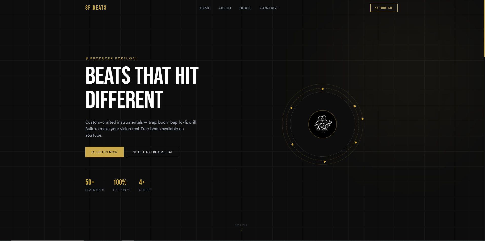

# SFBEATS



SFBEATS is a React + Vite demo app that showcases a beat catalog for music producer and artist SF. It is designed as a clean, responsive landing page where users can browse beat cards, open beat details, and explore a modern music showcase.

## Purpose

The project purpose is to present beats in a polished frontend experience with a strong musical brand feel, helping listeners and buyers preview and explore available tracks.

## Notes

- Built with React and Vite
- Responsive UI for beats and contact section
- Google sign-in gates the email & Instagram contacts
- Intended as a portfolio/demo music showcase

## Getting started

```bash
npm install
cp .env.example .env   # then fill in your Google Client ID
npm run dev
```

### Environment variables

The contact section uses Google sign-in via [`@react-oauth/google`](https://www.npmjs.com/package/@react-oauth/google). Create a `.env` file (copied from `.env.example`) with:

```ini
VITE_GOOGLE_CLIENT_ID=your-client-id.apps.googleusercontent.com
```

Get the **Client ID** (ends in `.apps.googleusercontent.com`, *not* the client secret) from the [Google Cloud Console → Credentials](https://console.cloud.google.com/apis/credentials). Add your app origin (e.g. `http://localhost:5173`) to the OAuth client's **Authorized JavaScript origins**. `.env` is gitignored — never commit credentials.

## Scripts

| Command | Description |
| --- | --- |
| `npm run dev` | Start the dev server |
| `npm run build` | Production build to `dist/` |
| `npm run preview` | Preview the production build |
| `npm run lint` | Run ESLint |
| `npm run test:run` | Run unit tests (Vitest) |
| `npm run test:e2e` | Run end-to-end tests (Playwright) |
